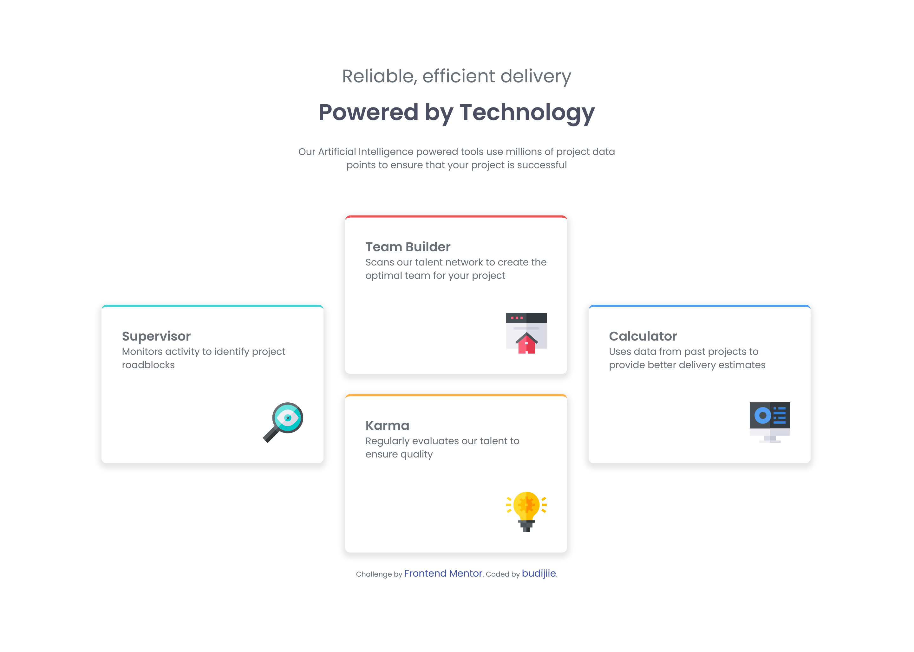
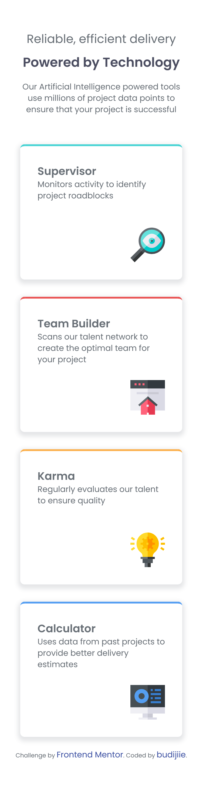

# Frontend Mentor - Four card feature section

## Welcome! 👋

Thanks for checking out this front-end coding challenge.

## Table of contents

- [Overview](#overview)
  - [The challenge](#the-challenge)
  - [Screenshot](#screenshot)
  - [Links](#links)
- [My process](#my-process)
  - [Built with](#built-with)
  - [What I learned](#what-i-learned)
  - [Useful resources](#useful-resources)
- [Author](#author)

## Overview

### The challenge

Users should be able to:

- View the optimal layout for the site depending on their device's screen size

### Screenshot

### Dekstop Screenshot

### Mobile Screenshot

### Links

- Solution URL: [Add solution URL here](https://www.frontendmentor.io/solutions/four-card-feature-section-K-CwUdRiuh)
- Live Site URL: [Add live site URL here](https://budijiie.github.io/four-card-feature-section/)

## My process

### Built with

- Semantic HTML5 markup
- CSS custom properties
- Flexbox
- CSS Grid
- Mobile-first workflow

### What I learned

This is my first time use css grid and build with mobile view first. 

### Useful resources

- [Kevin Powell - youtube](https://youtu.be/rg7Fvvl3taU?si=nLTPhHZwJ6O205HG) - This is an amazing channel which helped me finally understand css grid and flexbox. I'd recommend it to anyone still learning this concept.
- [Slaying the dragon - youtube](https://youtu.be/EiNiSFIPIQE?si=k8bnTOCzdvz5EziY) - This channel helped me too with css grid

## Author

- Frontend Mentor - [@budijiie](https://www.frontendmentor.io/profile/budijiie)

**Have fun building!** 🚀
